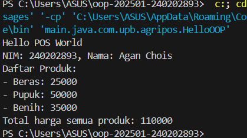

# Laporan Praktikum Minggu 1 
Topik: Pengenalan Paradigma dan Setup Proyek

## Identitas
- Nama  : Agan Chois
- NIM   : 240202893
- Kelas : 3IKRB

---

## Tujuan
- Mahasiswa mampu mendefinisikan paradigma prosedural, OOP, dan fungsional.
- Mahasiswa mampu membandingkan kelebihan dan keterbatasan tiap paradigma.
- Mahasiswa mampu memberikan contoh program sederhana untuk masing-masing paradigma.
- Mahasiswa aktif dalam diskusi kelas (bertanya, menjawab, memberi opini).


## Dasar Teori
- **Prosedural**: program dibangun sebagai rangkaian perintah (fungsi/prosedur).  
- **OOP (Object-Oriented Programming)**: program dibangun dari objek yang memiliki data (atribut) dan perilaku (method).  
- **Fungsional**: program dipandang sebagai pemetaan fungsi matematika, lebih menekankan ekspresi dan transformasi data.  


---

## Langkah Praktikum
1. **Setup Project**
   - Pastikan sudah menginstall **JDK** (Java Development Kit), **IDE** (misal: IntelliJ IDEA, VS Code, NetBeans), **Git**, **PostgreSQL**, dan **JavaFX** di komputer.
   - Buat folder project `oop-pos-<nim>`.
   - Inisialisasi repositori Git.
   - Buat struktur awal `src/main/java/com/upb/agripos/`.
   - Pastikan semua tools dapat berjalan (uji dengan membuat dan menjalankan program Java sederhana).

2. **Program Sederhana dalam 3 Paradigma**
   - Prosedural: program untuk menghitung total harga dua produk.
   - OOP: class `Produk` dengan atribut nama dan harga, buat minimal tiga objek, lalu hitung total.  
   - Fungsional: gunakan `Stream` atau lambda untuk menghitung total harga dari minimal tiga objek.  

3. **Commit dan Push**
   - Commit dengan pesan: `week1-setup-hello-pos`.  


---

## Kode Program
### 1. Uji Instalasi
- Buat file `HelloWorld.java`:
```java
public class HelloWorld {
    public static void main(String[] args) {
        System.out.println("Hello Agan Chois");
    }
}
```
### 2. Prosedural
```java
// HelloProcedural.java
public class HelloProcedural {
   public static void main(String[] args) {
      String nim = "240202893";
      String nama = "Agan Chois";
      String[] produk = {"Beras", "Pupuk", "Benih"};
      int[] harga = {25000, 50000, 35000};
      int total = 0;
      System.out.println("Hello POS World");
      System.out.println("NIM: " + nim + ", Nama: " + nama);
      System.out.println("Daftar Produk:");
      for (int i = 0; i < produk.length; i++) {
         System.out.println("- " + produk[i] + ": " + harga[i]);
         total += harga[i];
      }
      System.out.println("Total harga semua produk: " + total);
   }
}

```
### 3. OOP
```java
// HelloOOP.java
class Produk {
   String nama;
   int harga;
   Produk(String nama, int harga) {
      this.nama = nama;
      this.harga = harga;
   }
}

public class HelloOOP {
   public static void main(String[] args) {
      String nim = "240202893";
      String namaMhs = "Agan Chois";
      Produk[] daftar = {
         new Produk("Beras", 25000),
         new Produk("Pupuk", 50000),
         new Produk("Benih", 35000)
      };
      int total = 0;
      System.out.println("Hello POS World");
      System.out.println("NIM: " + nim + ", Nama: " + namaMhs);
      System.out.println("Daftar Produk:");
      for (Produk p : daftar) {
         System.out.println("- " + p.nama + ": " + p.harga);
         total += p.harga;
      }
      System.out.println("Total harga semua produk: " + total);
   }
}
```
### 4. Fungsional
```java
// HelloFunctional.java
import java.util.*;
import java.util.stream.*;
public class HelloFunctional {
   public static void main(String[] args) {
      String nim = "240202893";
      String nama = "Agan Chois";
      List<String> produk = Arrays.asList("Beras", "Pupuk", "Benih");
      List<Integer> harga = Arrays.asList(25000, 50000, 35000);
      System.out.println("Hello POS World");
      System.out.println("NIM: " + nim + ", Nama: " + nama);
      System.out.println("Daftar Produk:");
      IntStream.range(0, produk.size())
         .forEach(i -> System.out.println("- " + produk.get(i) + ": " + harga.get(i)));
      int total = harga.stream().mapToInt(Integer::intValue).sum();
      System.out.println("Total harga semua produk: " + total);
   }
}
```
---

## Hasil Eksekusi 
Hasil 1:


Hasil 2:


Hasil 3:



Hasil 4:


---

## Analisis
Kode Java dimulai dari program sederhana HelloWorld.java yang mencetak teks ke layar menggunakan method main, menunjukkan bahwa instalasi dan eksekusi Java berjalan dengan baik. Pendekatan minggu ini berbeda karena tidak hanya mengenalkan sintaks dasar, tetapi juga memperkenalkan tiga gaya pemrograman: prosedural, berorientasi objek, dan fungsional. Dalam pendekatan prosedural, seluruh logika dijalankan berurutan di dalam satu fungsi, sedangkan pada OOP digunakan kelas dan objek agar program lebih terstruktur dan mudah dikembangkan. Pendekatan fungsional menggunakan konsep lambda dan Stream API untuk menulis kode lebih singkat dan efisien dalam memproses data. Kendala yang umum seperti error instalasi atau kesalahan nama file dapat diatasi dengan memastikan Java terpasang dengan benar dan penulisan kode sesuai aturan sintaks.
---

## Kesimpulan
Setiap pendekatan memiliki cara kerja dan keunggulan berbeda. Pendekatan prosedural lebih sederhana dan mudah dipahami untuk program kecil, sementara OOP memberikan struktur yang rapi dan fleksibel untuk pengembangan jangka panjang. Pendekatan fungsional menawarkan cara yang lebih modern dan efisien dalam memproses data dengan kode yang ringkas. Melalui perbandingan ini, kita dapat memahami evolusi cara berpikir dalam pemrograman dari langkah-langkah terurut menuju konsep berbasis objek dan fungsi.

---

## Quiz
1. Apakah OOP selalu lebih baik dari prosedural?
   **Jawaban:** Tidak selalu, karena OOP dan prosedural memiliki keunggulan masing-masing tergantung pada kebutuhan program. OOP lebih baik untuk proyek besar yang kompleks dan membutuhkan struktur yang jelas, sedangkan prosedural lebih efisien untuk program kecil yang sederhana.

2. Kapan functional programming lebih cocok digunakan dibanding OOP atau prosedural?
   **Jawaban:** Functional programming lebih cocok digunakan saat memproses data dalam jumlah besar, operasi paralel, atau ketika dibutuhkan kode yang ringkas dan mudah diuji. Paradigma ini efektif dalam analisis data, pemrograman reaktif, dan aplikasi yang berfokus pada transformasi data.

3. Bagaimana paradigma (prosedural, OOP, fungsional) memengaruhi maintainability dan scalability aplikasi?
   **Jawaban:** Paradigma yang digunakan memengaruhi seberapa mudah aplikasi diperbaiki dan dikembangkan. OOP meningkatkan maintainability dan scalability karena kode terorganisasi dalam kelas dan objek, sedangkan prosedural cenderung sulit dikelola saat program membesar, dan fungsional mempermudah pemeliharaan dengan mengurangi efek samping dan kode berulang.
4. Mengapa OOP lebih cocok untuk mengembangkan aplikasi POS dibanding prosedural?
   **Jawaban:** Karena aplikasi POS memiliki banyak entitas seperti produk, pelanggan, dan transaksi yang saling berhubungan, OOP memudahkan pengelolaan dengan membungkus data dan perilaku dalam objek. Pendekatan ini membuat sistem lebih modular, mudah diperluas, dan lebih aman terhadap perubahan.

5. Bagaimana paradigma fungsional dapat membantu mengurangi kode berulang (*boilerplate code*)?
   **Jawaban:** Paradigma fungsional mengurangi kode berulang dengan memanfaatkan fungsi-fungsi murni, ekspresi lambda, dan operasi berbasis koleksi seperti map, filter, dan reduce. Dengan cara ini, logika yang sama tidak perlu ditulis berulang, sehingga kode menjadi lebih singkat, jelas, dan mudah dipelihara.
