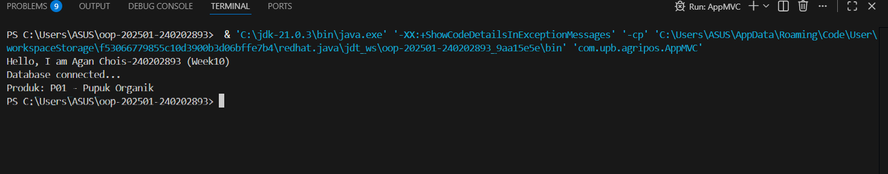
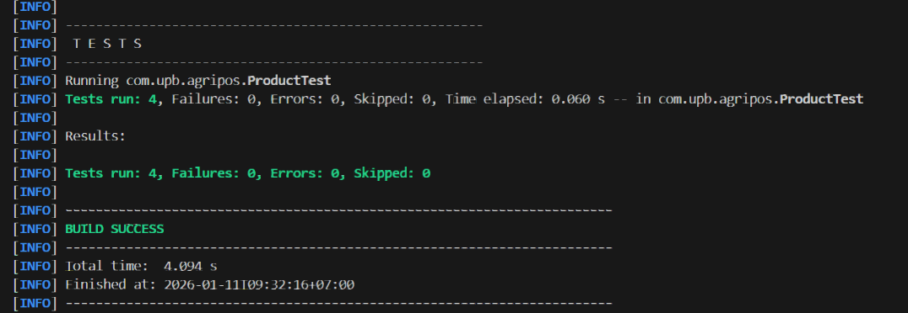

# Laporan Praktikum Minggu 10 
Topik: Design Pattern (Singleton, MVC) dan Unit Testing menggunakan JUnit

## Identitas
- Nama  : Agan Chois
- NIM   : 240202893
- Kelas : 3IKRB

---

## Tujuan
1. Menjelaskan konsep dasar design pattern dalam rekayasa perangkat lunak.
2. Mengimplementasikan Singleton Pattern dengan benar.
3. Menjelaskan dan menerapkan Model–View–Controller (MVC) pada aplikasi sederhana.
4. Membuat dan menjalankan unit test menggunakan JUnit.
5. Menganalisis manfaat penerapan design pattern dan unit testing terhadap kualitas perangkat lunak.

---

## Dasar Teori
1. Design Pattern adalah solusi desain yang sudah teruji untuk menyelesaikan masalah umum dalam pengembangan perangkat lunak agar kode lebih terstruktur dan mudah dirawat.
2. Singleton Pattern memastikan sebuah class hanya memiliki satu instance sehingga cocok digunakan untuk resource global seperti koneksi database.
3. MVC (Model–View–Controller) memisahkan logika data, tampilan, dan kontrol alur program agar aplikasi lebih terorganisir dan mudah dikembangkan.
4. OOP (Object-Oriented Programming) memungkinkan pemodelan sistem menggunakan class dan object yang merepresentasikan dunia nyata.
5. Unit Testing dengan JUnit digunakan untuk menguji bagian kecil kode secara otomatis guna memastikan fungsi berjalan sesuai harapan dan mengurangi bug.

---

## Langkah Praktikum
1. Buat Project Java dan package `com.upb.agripos`.
2. Implementasikan Singleton pada class `DatabaseConnection` untuk koneksi global.
3. Buat MVC:
   * Model: `Product`
   * View: `ConsoleView`
   * Controller: `ProductController`
4. Integrasikan MVC** di `AppMVC` dan jalankan program.
5. Buat Unit Test JUnit (`ProductTest`) untuk menguji method `getName()`.
6. Jalankan Unit Test, pastikan hasil PASS, lalu ambil screenshot.
7. Dokumentasikan hasil praktikum dan lakukan commit ke repository.

---

## Kode Program
### 1. Model
```java
package com.upb.agripos.model;


public class Product {

    private final String code;
    private final String name;

    public Product(String code, String name) {
        this.code = code;
        this.name = name;
    }

    public String getCode() {
        return code;
    }

    public String getName() {
        return name;
    }
}
```

### 2. View
```java
package com.upb.agripos.view;

public class ConsoleView {

    public void showMessage(String message) {
        System.out.println(message);
    }
}

```

### 3. Controller 
```java
package com.upb.agripos.controller;

import com.upb.agripos.model.Product;
import com.upb.agripos.view.ConsoleView;

public class ProductController {

    private final Product model;
    private final ConsoleView view;

    public ProductController(Product model, ConsoleView view) {
        this.model = model;
        this.view = view;
    }

    public void showProduct() {
        view.showMessage(
            "Produk: " + model.getCode() + " - " + model.getName()
        );
    }
}
```

### 4. Main Program (Integrasi MVC)
```java
package com.upb.agripos;

import com.upb.agripos.config.DatabaseConnection;
import com.upb.agripos.controller.ProductController;
import com.upb.agripos.model.Product;
import com.upb.agripos.view.ConsoleView;

public class AppMVC {

    public static void main(String[] args) {

        System.out.println("Hello, I am Agan Chois-240202893 (Week10)");

        // Singleton dipanggil
        DatabaseConnection db1 = DatabaseConnection.getInstance();
        DatabaseConnection db2 = DatabaseConnection.getInstance();

        // MVC
        Product product = new Product("P01", "Pupuk Organik");
        ConsoleView view = new ConsoleView();
        ProductController controller = new ProductController(product, view);

        controller.showProduct();
    }
}
```
---

## Hasil Eksekusi


---

## Analisis
Kode dijalankan dengan menerapkan pola MVC, di mana data produk dibuat pada Model, ditampilkan melalui View, dan dikendalikan oleh Controller yang menghubungkan keduanya, sementara Singleton memastikan hanya satu instance koneksi yang digunakan, serta JUnit digunakan untuk menguji fungsi agar berjalan sesuai harapan. Pendekatan pada minggu ini berbeda dari minggu sebelumnya karena sudah menggunakan design pattern dan unit testing sehingga kode lebih terstruktur, modular, dan mudah diuji, tidak lagi ditulis secara langsung dalam satu kelas. Kendala yang dihadapi umumnya adalah **konfigurasi JUnit yang tidak dikenali IDE, namun dapat diatasi dengan menambahkan dependency JUnit dengan benar dan memastikan struktur folder `src/test/java` sudah sesuai.

---

## Kesimpulan
Melalui praktikum ini dapat disimpulkan bahwa penerapan design pattern Singleton dan MVC membuat struktur program lebih rapi, terorganisir, dan mudah dikembangkan, sedangkan penggunaan unit testing dengan JUnit membantu memastikan fungsi program berjalan dengan benar sejak tahap awal. Pendekatan ini meningkatkan kualitas kode, mempermudah pemeliharaan, serta mengurangi potensi kesalahan dibandingkan penulisan kode tanpa pola dan pengujian.

---

## Quiz
1. **Mengapa constructor pada Singleton harus bersifat private?**
   **Jawaban:** Agar object tidak bisa dibuat secara bebas dari luar class sehingga jumlah instance dapat dikontrol dan dipastikan hanya ada satu instance selama aplikasi berjalan.

2. **Jelaskan manfaat pemisahan Model, View, dan Controller.**
   **Jawaban:** Pemisahan MVC membuat kode lebih terstruktur, mudah dipahami, mudah dikembangkan, serta memudahkan perawatan karena setiap bagian memiliki tanggung jawab yang jelas.

3. **Apa peran unit testing dalam menjaga kualitas perangkat lunak?**
   **Jawaban:** Unit testing berperan untuk memastikan setiap fungsi berjalan sesuai harapan, mendeteksi kesalahan sejak dini, dan mencegah bug muncul saat aplikasi dikembangkan lebih lanjut.

4. **Apa risiko jika Singleton tidak diimplementasikan dengan benar?**
   **Jawaban:** Risiko yang dapat terjadi adalah terbentuknya lebih dari satu instance, pemborosan resource, konflik data, serta perilaku aplikasi yang tidak konsisten.

