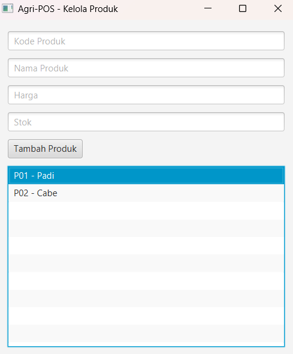

# Laporan Praktikum Minggu 12 
Topik: GUI Dasar JavaFX (Event-Driven Programming)

## Identitas
- Nama  : Agan Chois
- NIM   : 240202893
- Kelas : 3IKRB

---

## Tujuan
1. Menjelaskan konsep event-driven programming.
2. Membangun antarmuka grafis sederhana menggunakan JavaFX.
3. Membuat form input data produk.
4. Menampilkan daftar produk pada GUI.
5. Mengintegrasikan GUI dengan modul backend yang telah dibuat (DAO & Service).

---

## Dasar Teori
1. **Event-Driven Programming** – Program bereaksi terhadap kejadian (event) seperti klik tombol, input teks, atau perubahan data, bukan hanya menjalankan perintah secara berurutan.
2. **MVC (Model-View-Controller)** – Pola desain yang memisahkan logika aplikasi (Model), antarmuka pengguna (View), dan pengontrol interaksi (Controller) untuk mempermudah pengembangan dan pemeliharaan.
3. **JavaFX GUI Components** – Elemen seperti `TextField`, `Button`, dan `ListView` digunakan untuk membuat antarmuka grafis interaktif di Java.
4. **Integrasi Service & DAO** – Layer Service menghubungkan GUI (Controller) dengan akses data (DAO) sehingga View tidak langsung melakukan CRUD, sesuai prinsip **DIP (SOLID)**.

---

## Langkah Praktikum
1. **Setup & Persiapan**

   * Buat project Maven dengan struktur `src/main/java/com/upb/agripos/`
   * Pastikan JavaFX SDK terpasang atau gunakan dependency Maven
   * Buat `.vscode/extensions.json` untuk rekomendasi Java & JavaFX

2. **Coding**

   * `Product.java` → model
   * `ProductDAO.java` → akses database PostgreSQL
   * `ProductService.java` → layer service
   * `ProductController.java` → logika aplikasi
   * `ProductFormView.java` → JavaFX GUI + event handler
   * `AppJavaFX.java` → main class

3. **Run & Test**

   * Jalankan via VS Code atau terminal:

     ```bash
     mvn clean javafx:run
     ```
   * Tambah beberapa produk, pastikan muncul di ListView & database

4. **Commit Message**

```
week12-gui-dasar: implementasi GUI JavaFX tambah & tampil produk terintegrasi service DAO
```
---

## Kode Program 

```java
// 1️. Model — Product.java
package com.upb.agripos.model;

public class Product {
    private String code;
    private String name;
    private double price;
    private int stock;

    public Product(String code, String name, double price, int stock) {
        this.code = code;
        this.name = name;
        this.price = price;
        this.stock = stock;
    }

    public String getCode() { return code; }
    public String getName() { return name; }
    public double getPrice() { return price; }
    public int getStock() { return stock; }
}

// 2️. DAO — ProductDAO.java
package com.upb.agripos.dao;

import com.upb.agripos.model.Product;
import java.sql.*;

public class ProductDAO {

    private Connection getConnection() throws SQLException {
        return DriverManager.getConnection(
            "jdbc:postgresql://localhost:5432/agripos",
            "postgres",
            "password"
        );
    }

    public void insert(Product product) {
        String sql = "INSERT INTO products(code, name, price, stock) VALUES (?, ?, ?, ?)";
        try (Connection conn = getConnection();
             PreparedStatement ps = conn.prepareStatement(sql)) {

            ps.setString(1, product.getCode());
            ps.setString(2, product.getName());
            ps.setDouble(3, product.getPrice());
            ps.setInt(4, product.getStock());
            ps.executeUpdate();

        } catch (SQLException e) {
            e.printStackTrace();
        }
    }
}

// 3️. Service — ProductService.java
package com.upb.agripos.service;

import com.upb.agripos.dao.ProductDAO;
import com.upb.agripos.model.Product;

public class ProductService {

    private ProductDAO productDAO;

    public ProductService() {
        this.productDAO = new ProductDAO();
    }

    public void addProduct(Product product) {
        productDAO.insert(product);
    }
}

// 4️. Controller — ProductController.java
package com.upb.agripos.controller;

import com.upb.agripos.model.Product;
import com.upb.agripos.service.ProductService;

public class ProductController {

    private ProductService productService;

    public ProductController() {
        this.productService = new ProductService();
    }

    public Product tambahProduk(String code, String name, double price, int stock) {
        Product product = new Product(code, name, price, stock);
        productService.addProduct(product);
        return product;
    }
}

// 5️. View — ProductFormView.java
package com.upb.agripos.view;

import com.upb.agripos.controller.ProductController;
import com.upb.agripos.model.Product;
import javafx.geometry.Insets;
import javafx.scene.control.*;
import javafx.scene.layout.VBox;

public class ProductFormView extends VBox {

    private TextField txtCode = new TextField();
    private TextField txtName = new TextField();
    private TextField txtPrice = new TextField();
    private TextField txtStock = new TextField();
    private Button btnAdd = new Button("Tambah Produk");
    private ListView<String> listView = new ListView<>();

    private ProductController controller = new ProductController();

    public ProductFormView() {
        setPadding(new Insets(15));
        setSpacing(10);

        txtCode.setPromptText("Kode Produk");
        txtName.setPromptText("Nama Produk");
        txtPrice.setPromptText("Harga");
        txtStock.setPromptText("Stok");

        btnAdd.setOnAction(event -> tambahProduk());

        getChildren().addAll(
            txtCode,
            txtName,
            txtPrice,
            txtStock,
            btnAdd,
            listView
        );
    }

    private void tambahProduk() {
        try {
            Product p = controller.tambahProduk(
                txtCode.getText(),
                txtName.getText(),
                Double.parseDouble(txtPrice.getText()),
                Integer.parseInt(txtStock.getText())
            );

            listView.getItems().add(
                p.getCode() + " - " + p.getName()
            );

            clearForm();

        } catch (Exception e) {
            Alert alert = new Alert(Alert.AlertType.ERROR);
            alert.setContentText("Input tidak valid!");
            alert.show();
        }
    }

    private void clearForm() {
        txtCode.clear();
        txtName.clear();
        txtPrice.clear();
        txtStock.clear();
    }
}

// 6️. Main App — AppJavaFX.java
package com.upb.agripos;

import com.upb.agripos.view.ProductFormView;
import javafx.application.Application;
import javafx.scene.Scene;
import javafx.stage.Stage;

public class AppJavaFX extends Application {

    @Override
    public void start(Stage stage) {
        ProductFormView view = new ProductFormView();
        Scene scene = new Scene(view, 400, 450);

        stage.setTitle("Agri-POS - Kelola Produk");
        stage.setScene(scene);
        stage.show();
    }

    public static void main(String[] args) {
        launch();
    }
}

// 7️ Commit Message
// week12-gui-dasar: implementasi GUI JavaFX tambah & tampil produk terintegrasi service DAO

```
---

## Hasil Eksekusi 

---

## Analisis
kode berjalan dengan pendekatan MVC di mana ProductFormView sebagai View menampilkan form input dan ListView, ProductController menangani logika penambahan produk, ProductService menghubungkan ke ProductDAO untuk melakukan operasi database PostgreSQL, sehingga event klik tombol “Tambah Produk” memicu alur View → Controller → Service → DAO → DB → update UI. Pendekatan minggu ini berbeda dari minggu sebelumnya karena GUI tidak langsung memanggil DAO, melainkan menggunakan service sebagai perantara sesuai prinsip DIP (SOLID), sedangkan minggu sebelumnya logika CRUD dilakukan langsung di kode non-GUI atau console. Kendala yang dihadapi antara lain konfigurasi JavaFX di VS Code dan error Stage yang muncul karena JavaFX tidak dikenali; kendala ini diatasi dengan membuat project Maven, menambahkan dependency JavaFX, dan menggunakan VM arguments atau plugin Maven javafx-maven-plugin sehingga GUI dapat dijalankan tanpa masalah.
---

## Kesimpulan
Kesimpulannya, praktikum ini berhasil memperlihatkan bagaimana JavaFX digunakan untuk membuat GUI event-driven yang terintegrasi dengan backend melalui Service dan DAO, menerapkan MVC dan prinsip SOLID (DIP) sehingga View tidak langsung mengakses database, serta memperkuat pemahaman mahasiswa tentang alur interaksi program, validasi input, dan pengelolaan data produk secara terstruktur.
---


