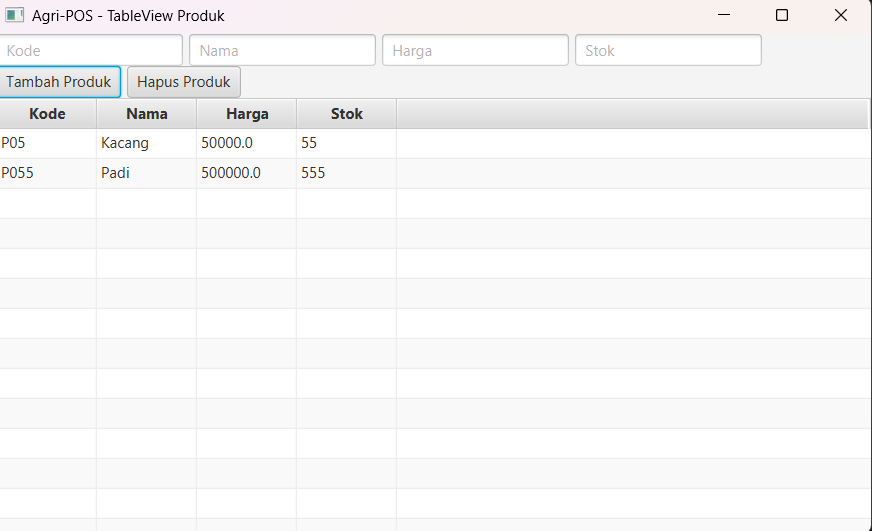

# Laporan Praktikum Minggu 13
Topik: GUI Lanjutan JavaFX (TableView dan Lambda Expression)

## Identitas
- Nama  : Agan Chois
- NIM   : 240202893
- Kelas : 3IKRB

---

## Tujuan
1. Menampilkan data menggunakan TableView JavaFX.
2. Mengintegrasikan koleksi objek dengan GUI.
3. Menggunakan lambda expression untuk event handling.
4. Menghubungkan GUI dengan DAO secara penuh.
5. Membangun antarmuka GUI Agri-POS yang lebih interaktif.

---

## Dasar Teori
1. **Class** merupakan blueprint yang mendefinisikan atribut dan method dari suatu objek.
2. **Object** adalah instansiasi dari class yang merepresentasikan data nyata dalam program.
3. **DAO (Data Access Object)** digunakan untuk memisahkan logika akses database dari logika aplikasi.
4. **CRUD (Create, Read, Update, Delete)** adalah operasi dasar dalam pengelolaan data pada database.
5. **JavaFX** menerapkan konsep event-driven programming, di mana aksi pengguna (klik tombol) memicu proses tertentu dalam aplikasi.


---

## Langkah Praktikum
1. **Setup & Coding**
   Menyiapkan project JavaFX lanjutan, mengonfigurasi `pom.xml`, lalu menambahkan fitur `TableView` serta event handler dengan lambda expression.
2. **File/Kode yang Dibuat atau Dimodifikasi**
   `Product.java`, `ProductDAO.java`, `ProductService.java`, `ProductTableView.java`, `ProductController.java`, dan `AppJavaFX.java`.
3. **Commit Message**
   `week13-gui-lanjutan: [fitur] tableview produk dengan tambah dan hapus`


---

## Kode Program

```java
1. AppJavaFX.java
package com.upb.agripos;

import com.upb.agripos.view.ProductTableView;
import javafx.application.Application;
import javafx.scene.Scene;
import javafx.stage.Stage;

public class AppJavaFX extends Application {

    @Override
    public void start(Stage stage) {
        ProductTableView view = new ProductTableView();
        Scene scene = new Scene(view.getView(), 800, 450);

        stage.setTitle("Agri-POS - Week 13 GUI Lanjutan");
        stage.setScene(scene);
        stage.show();
    }

    public static void main(String[] args) {
        launch(args);
    }
}

2. Product.java
package com.upb.agripos.model;

import javafx.beans.property.*;

public class Product {

    private final StringProperty code = new SimpleStringProperty();
    private final StringProperty name = new SimpleStringProperty();
    private final DoubleProperty price = new SimpleDoubleProperty();
    private final IntegerProperty stock = new SimpleIntegerProperty();

    public Product(String code, String name, double price, int stock) {
        this.code.set(code);
        this.name.set(name);
        this.price.set(price);
        this.stock.set(stock);
    }

    public StringProperty codeProperty() {
        return code;
    }

    public StringProperty nameProperty() {
        return name;
    }

    public DoubleProperty priceProperty() {
        return price;
    }

    public IntegerProperty stockProperty() {
        return stock;
    }
}

3. ProductService.java
package com.upb.agripos.service;

import com.upb.agripos.model.Product;
import javafx.collections.*;

public class ProductService {

    private final ObservableList<Product> products =
            FXCollections.observableArrayList();

    public ObservableList<Product> findAll() {
        return products;
    }

    public void add(Product product) {
        products.add(product);
    }

    public void delete(Product product) {
        products.remove(product);
    }
}

4. ProductController.java
package com.upb.agripos.controller;

import com.upb.agripos.model.Product;
import com.upb.agripos.service.ProductService;
import javafx.collections.ObservableList;

public class ProductController {

    private final ProductService service = new ProductService();

    public ObservableList<Product> loadData() {
        return service.findAll();
    }

    public void addProduct(String code, String name, double price, int stock) {
        service.add(new Product(code, name, price, stock));
    }

    public void deleteProduct(Product product) {
        service.delete(product);
    }
}

5. ProductTableView.java
package com.upb.agripos.view;

import com.upb.agripos.controller.ProductController;
import com.upb.agripos.model.Product;
import javafx.geometry.Insets;
import javafx.scene.Parent;
import javafx.scene.control.*;
import javafx.scene.layout.*;

public class ProductTableView {

    private final ProductController controller = new ProductController();
    private final TableView<Product> table = new TableView<>();

    public Parent getView() {

        TextField txtCode = new TextField();
        txtCode.setPromptText("Kode");

        TextField txtName = new TextField();
        txtName.setPromptText("Nama");

        TextField txtPrice = new TextField();
        txtPrice.setPromptText("Harga");

        TextField txtStock = new TextField();
        txtStock.setPromptText("Stok");

        Button btnAdd = new Button("Tambah Produk");
        Button btnDelete = new Button("Hapus Produk");

        TableColumn<Product, String> colCode = new TableColumn<>("Kode");
        colCode.setCellValueFactory(data -> data.getValue().codeProperty());

        TableColumn<Product, String> colName = new TableColumn<>("Nama");
        colName.setCellValueFactory(data -> data.getValue().nameProperty());

        TableColumn<Product, Number> colPrice = new TableColumn<>("Harga");
        colPrice.setCellValueFactory(data -> data.getValue().priceProperty());

        TableColumn<Product, Number> colStock = new TableColumn<>("Stok");
        colStock.setCellValueFactory(data -> data.getValue().stockProperty());

        table.getColumns().addAll(colCode, colName, colPrice, colStock);
        table.setItems(controller.loadData());

        // Lambda Expression
        btnAdd.setOnAction(e -> {
            controller.addProduct(
                    txtCode.getText(),
                    txtName.getText(),
                    Double.parseDouble(txtPrice.getText()),
                    Integer.parseInt(txtStock.getText())
            );
            txtCode.clear();
            txtName.clear();
            txtPrice.clear();
            txtStock.clear();
        });

        btnDelete.setOnAction(e -> {
            Product selected = table.getSelectionModel().getSelectedItem();
            if (selected != null) {
                controller.deleteProduct(selected);
            }
        });

        HBox form = new HBox(10, txtCode, txtName, txtPrice, txtStock);
        HBox buttons = new HBox(10, btnAdd, btnDelete);
        VBox root = new VBox(10, form, buttons, table);

        root.setPadding(new Insets(10));
        return root;
    }
}

```

---

## Hasil Eksekusi

---

## Analisis
Pada praktikum ini, kode berjalan dengan alur **MVC**, di mana `ProductTableView` sebagai **View** menampilkan `TableView` dan menangani event klik tombol menggunakan **lambda expression**, lalu meneruskan aksi ke `ProductController`, yang selanjutnya memanggil `ProductService` untuk menambah, menampilkan, atau menghapus data produk sehingga perubahan langsung tercermin pada `TableView`. Pendekatan minggu ini berbeda dengan minggu sebelumnya karena daftar produk tidak lagi ditampilkan secara sederhana, melainkan menggunakan **TableView** yang terikat pada **ObservableList**, serta event handling ditulis lebih ringkas menggunakan lambda expression, sedangkan pada minggu sebelumnya GUI masih bersifat dasar dan interaksi data terbatas. Kendala yang dihadapi meliputi error konfigurasi JavaFX, event tombol yang tidak berjalan, serta data yang tidak langsung muncul di tabel, dan masalah tersebut diatasi dengan perbaikan struktur MVC, penggunaan properti JavaFX (`Property`), serta memastikan `TableView` terhubung langsung ke data dari service melalui `ObservableList`.

---

## Kesimpulan
Dengan menggunakan JavaFX lanjutan berbasis **TableView** dan **lambda expression**, aplikasi Agri-POS dapat menampilkan, menambah, dan menghapus data produk secara interaktif dan terintegrasi langsung dengan backend melalui `Service` dan `DAO`. Penerapan pola **MVC** dan prinsip **SOLID (DIP)** membuat kode lebih terstruktur, mudah dipelihara, serta memisahkan dengan jelas antara tampilan, logika bisnis, dan akses data.

---
