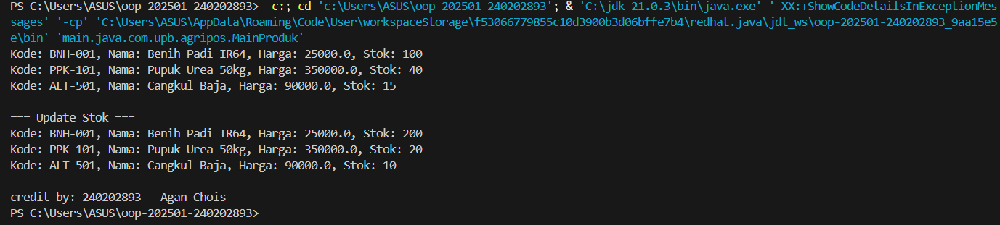

# Laporan Praktikum Minggu 1 (sesuaikan minggu ke berapa?)
Topik: Class dan Object (Produk Pertanian)


## Identitas
- Nama  : Agan Chois
- NIM   : 240202893
- Kelas : 3IKRB

---

## Tujuan
- Mahasiswa mampu **menjelaskan konsep class, object, atribut, dan method** dalam OOP.  
- Mahasiswa mampu **menerapkan access modifier dan enkapsulasi** dalam pembuatan class.  
- Mahasiswa mampu **mengimplementasikan class Produk pertanian** dengan atribut dan method yang sesuai.  
- Mahasiswa mampu **mendemonstrasikan instansiasi object** serta menampilkan data produk pertanian di console.  
- Mahasiswa mampu **menyusun laporan praktikum** dengan bukti kode, hasil eksekusi, dan analisis sederhana.  

---

## Dasar Teori
Class adalah blueprint atau cetak biru dari sebuah objek. Objek merupakan instansiasi dari class yang berisi atribut (data) dan method (perilaku). Dalam OOP, enkapsulasi dilakukan dengan menyembunyikan data menggunakan access modifier (public, private, protected) serta menyediakan akses melalui getter dan setter.  

Dalam konteks Agri-POS, produk pertanian seperti benih, pupuk, dan alat pertanian dapat direpresentasikan sebagai objek yang memiliki atribut nama, harga, dan stok. Dengan menggunakan class, setiap produk dapat dibuat, dikelola, dan dimanipulasi secara lebih terstruktur.

---

## Langkah Praktikum
1. **Membuat Class Produk**
   - Buat file `Produk.java` pada package `model`.
   - Tambahkan atribut: `kode`, `nama`, `harga`, dan `stok`.
   - Gunakan enkapsulasi dengan menjadikan atribut bersifat private dan membuat getter serta setter untuk masing-masing atribut.  

2. **Membuat Class CreditBy**
   - Buat file `CreditBy.java` pada package `util`.
   - Isi class dengan method statis untuk menampilkan identitas mahasiswa di akhir output: `credit by: <NIM> - <Nama>`.

3. **Membuat Objek Produk dan Menampilkan Credit**
   - Buat file `MainProduk.java`.
   - Instansiasi minimal tiga objek produk, misalnya "Benih Padi", "Pupuk Urea", dan satu produk alat pertanian.
   - Tampilkan informasi produk melalui method getter.  
   - Panggil `CreditBy.print("<NIM>", "<Nama>")` di akhir `main` untuk menampilkan identitas.

4. **Commit dan Push**
   - Commit dengan pesan: `week2-class-object`.  

---

## Kode Program
### 1. Produk.java
```java
package main.java.com.upb.agripos.model;

public class Produk {
    private String kode;
    private String nama;
    private double harga;
    private int stok;

    public Produk(String kode, String nama, double harga, int stok) {
        this.kode = kode;
        this.nama = nama;
        this.harga = harga;
        this.stok = stok;
    }

    public String getKode() { return kode; }
    public void setKode(String kode) { this.kode = kode; }

    public String getNama() { return nama; }
    public void setNama(String nama) { this.nama = nama; }

    public double getHarga() { return harga; }
    public void setHarga(double harga) { this.harga = harga; }

    public int getStok() { return stok; }
    public void setStok(int stok) { this.stok = stok; }

    public void tambahStok(int jumlah) {
        this.stok += jumlah;
    }

    public void kurangiStok(int jumlah) {
        if (this.stok >= jumlah) {
            this.stok -= jumlah;
        } else {
            System.out.println("Stok tidak mencukupi!");
        }
    }
}
```

### 2. CreditBy.java
```java
package main.java.com.upb.agripos.util;

public class CreditBy {
    public static void print(String nim, String nama) {
        System.out.println("\ncredit by: " + nim + " - " + nama);
    }
}
```

### 3. MainProduk.java
```java
package main.java.com.upb.agripos;

import main.java.com.upb.agripos.model.Produk;
import main.java.com.upb.agripos.util.CreditBy;

public class MainProduk {
    public static void main(String[] args) {
        Produk p1 = new Produk("BNH-001", "Benih Padi IR64", 25000, 100);
        Produk p2 = new Produk("PPK-101", "Pupuk Urea 50kg", 350000, 40);
        Produk p3 = new Produk("ALT-501", "Cangkul Baja", 90000, 15);

        System.out.println("Kode: " + p1.getKode() + ", Nama: " + p1.getNama() + ", Harga: " + p1.getHarga() + ", Stok: " + p1.getStok());
        System.out.println("Kode: " + p2.getKode() + ", Nama: " + p2.getNama() + ", Harga: " + p2.getHarga() + ", Stok: " + p2.getStok());
        System.out.println("Kode: " + p3.getKode() + ", Nama: " + p3.getNama() + ", Harga: " + p3.getHarga() + ", Stok: " + p3.getStok());
        
        p1.tambahStok(100);
        p2.kurangiStok(20);
        p3.kurangiStok(5);
        
        System.out.println("\n=== Update Stok ===");
        System.out.println("Kode: " + p1.getKode() + ", Nama: " + p1.getNama() + ", Harga: " + p1.getHarga() + ", Stok: " + p1.getStok());
        System.out.println("Kode: " + p2.getKode() + ", Nama: " + p2.getNama() + ", Harga: " + p2.getHarga() + ", Stok: " + p2.getStok());
        System.out.println("Kode: " + p3.getKode() + ", Nama: " + p3.getNama() + ", Harga: " + p3.getHarga() + ", Stok: " + p3.getStok());

        // Tampilkan identitas mahasiswa
        CreditBy.print("240202893", "Agan Chois");
    }
}
```
---

## Hasil Eksekusi

Hasil:



---

## Analisis
Produk.java, CreditBy.java, dan MainProduk.java, masing-masing disusun menggunakan konsep Object-Oriented Programming (OOP). File Produk.java berisi kelas Produk yang merepresentasikan data barang dengan atribut seperti kode, nama, harga, dan stok, serta memiliki getter, setter, dan metode untuk menambah atau mengurangi stok. File CreditBy.java berfungsi mencetak identitas pembuat program melalui metode print(). File utama MainProduk.java menjadi titik eksekusi program dengan membuat tiga objek Produk, menampilkan data awal, mengubah stok melalui pemanggilan metode dari objek, lalu menampilkan hasil perubahannya di layar bersama identitas mahasiswa. Pendekatan minggu ini berbeda dari minggu sebelumnya karena sudah menerapkan konsep modularitas dan enkapsulasi dalam OOP, di mana kode dibagi menjadi beberapa kelas dengan tanggung jawab spesifik sehingga lebih mudah diatur dan dikembangkan dibanding pendekatan prosedural yang hanya menggunakan satu fungsi main. Kendala yang umum terjadi adalah error seperti ClassNotFoundException akibat kesalahan struktur package atau direktori, yang dapat diatasi dengan memastikan struktur folder sesuai dengan deklarasi package di awal file dan menjalankan program dari direktori utama proyek menggunakan perintah yang benar seperti java main.java.com.upb.agripos.MainProduk.
---

## Kesimpulan
program ini menunjukkan penerapan konsep dasar Object-Oriented Programming (OOP) dalam membangun aplikasi sederhana untuk pengelolaan produk. Dengan membagi kode ke dalam beberapa kelas seperti Produk, CreditBy, dan MainProduk, program menjadi lebih terstruktur, mudah dibaca, serta lebih fleksibel untuk dikembangkan di masa mendatang. Pendekatan ini juga memperlihatkan keunggulan OOP dalam mengorganisasi data dan perilaku objek secara terpisah namun saling terhubung. Melalui penerapan metode seperti getter, setter, dan manipulasi stok, konsep enkapsulasi dan interaksi antar objek dapat dipahami dengan jelas.
---

## Quiz
1. Mengapa atribut sebaiknya dideklarasikan sebagai private dalam class?  
   **Jawaban:** Atribut sebaiknya dideklarasikan sebagai private untuk melindungi data agar tidak dapat diakses atau diubah secara langsung dari luar kelas. Hal ini menjaga integritas data dan mencegah manipulasi yang tidak diinginkan. Dengan cara ini, akses terhadap atribut hanya bisa dilakukan melalui metode yang telah disediakan, sehingga lebih aman dan terkontrol. 

2. Apa fungsi getter dan setter dalam enkapsulasi?  
   **Jawaban:** Getter dan setter berfungsi sebagai penghubung antara atribut privat dengan dunia luar. Getter digunakan untuk mengambil nilai atribut, sedangkan setter digunakan untuk mengubah nilai atribut dengan validasi atau logika tertentu jika diperlukan. Dengan adanya getter dan setter, akses terhadap data menjadi lebih fleksibel tanpa melanggar prinsip enkapsulasi. 

3. Bagaimana cara class `Produk` mendukung pengembangan aplikasi POS yang lebih kompleks?  
   **Jawaban:** Kelas Produk menjadi pondasi utama karena merepresentasikan entitas barang yang dijual dalam sistem POS. Dengan adanya atribut seperti kode, nama, harga, dan stok serta metode untuk menambah dan mengurangi stok, kelas ini mudah dikembangkan untuk fitur yang lebih kompleks seperti transaksi, laporan penjualan, dan manajemen inventori. Struktur OOP pada kelas Produk juga memungkinkan integrasi dengan kelas lain seperti Transaksi atau Pelanggan secara efisien dan terorganisir.
