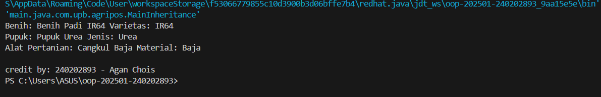

# Laporan Praktikum Minggu 3
Topik: Inheritance (Kategori Produk)

## Identitas
- Nama  : Agan Chois
- NIM   : 240202893
- Kelas : 3IKRB

---

## Tujuan
- Mahasiswa mampu **menjelaskan konsep inheritance (pewarisan class)** dalam OOP.  
- Mahasiswa mampu **membuat superclass dan subclass** untuk produk pertanian.  
- Mahasiswa mampu **mendemonstrasikan hierarki class** melalui contoh kode.  
- Mahasiswa mampu **menggunakan `super` untuk memanggil konstruktor dan method parent class**.  
- Mahasiswa mampu **membuat laporan praktikum** yang menjelaskan perbedaan penggunaan inheritance dibanding class tunggal.  

---

## Dasar Teori
Inheritance adalah mekanisme dalam OOP yang memungkinkan suatu class mewarisi atribut dan method dari class lain.  
- **Superclass**: class induk yang mendefinisikan atribut umum.  
- **Subclass**: class turunan yang mewarisi atribut/method superclass, dan dapat menambahkan atribut/method baru.  
- `super` digunakan untuk memanggil konstruktor atau method superclass.  

Dalam konteks Agri-POS, kita dapat membuat class `Produk` sebagai superclass, kemudian `Benih`, `Pupuk`, dan `AlatPertanian` sebagai subclass. Hal ini membuat kode lebih reusable dan terstruktur.
---

## Langkah Praktikum
1. **Membuat Superclass Produk**  
   - Gunakan class `Produk` dari Bab 2 sebagai superclass.  

2. **Membuat Subclass**  
   - `Benih.java` → atribut tambahan: varietas.  
   - `Pupuk.java` → atribut tambahan: jenis pupuk (Urea, NPK, dll).  
   - `AlatPertanian.java` → atribut tambahan: material (baja, kayu, plastik).  

3. **Membuat Main Class**  
   - Instansiasi minimal satu objek dari tiap subclass.  
   - Tampilkan data produk dengan memanfaatkan inheritance.  

4. **Menambahkan CreditBy**  
   - Panggil class `CreditBy` untuk menampilkan identitas mahasiswa.  

5. **Commit dan Push**  
   - Commit dengan pesan: `week3-inheritance`.  

---

## Kode Program
### Benih.java
```java
package main.java.com.upb.agripos.model;

public class Benih extends Produk {
    private String varietas;

    public Benih(String kode, String nama, double harga, int stok, String varietas) {
        super(kode, nama, harga, stok);
        this.varietas = varietas;
    }

    public String getVarietas() { return varietas; }
    public void setVarietas(String varietas) { this.varietas = varietas; }
}
```

### Pupuk.java
```java
package main.java.com.upb.agripos.model;

public class Pupuk extends Produk {
    private String jenis;

    public Pupuk(String kode, String nama, double harga, int stok, String jenis) {
        super(kode, nama, harga, stok);
        this.jenis = jenis;
    }

    public String getJenis() { return jenis; }
    public void setJenis(String jenis) { this.jenis = jenis; }
}
```

### AlatPertanian.java
```java
package main.java.com.upb.agripos.model;

public class AlatPertanian extends Produk {
    private String material;

    public AlatPertanian(String kode, String nama, double harga, int stok, String material) {
        super(kode, nama, harga, stok);
        this.material = material;
    }

    public String getMaterial() { return material; }
    public void setMaterial(String material) { this.material = material; }
}
```

### MainInheritance.java
```java
package main.java.com.upb.agripos;

import main.java.com.upb.agripos.model.*;
import main.java.com.upb.agripos.util.CreditBy;

public class MainInheritance {
    public static void main(String[] args) {
        Benih b = new Benih("BNH-001", "Benih Padi IR64", 25000, 100, "IR64");
        Pupuk p = new Pupuk("PPK-101", "Pupuk Urea", 350000, 40, "Urea");
        AlatPertanian a = new AlatPertanian("ALT-501", "Cangkul Baja", 90000, 15, "Baja");

        System.out.println("Benih: " + b.getNama() + " Varietas: " + b.getVarietas());
        System.out.println("Pupuk: " + p.getNama() + " Jenis: " + p.getJenis());
        System.out.println("Alat Pertanian: " + a.getNama() + " Material: " + a.getMaterial());

        CreditBy.print("240202893", "Agan Chois");
    }
}
```
---

## Hasil Eksekusi
 

---

## Analisis
Kode program ini berjalan dengan memanfaatkan konsep inheritance (pewarisan) di mana kelas Benih, Pupuk, dan AlatPertanian mewarisi atribut dan metode dari kelas induk Produk. Saat program dijalankan, objek-objek dari kelas turunan dibuat dan memanggil konstruktor induk untuk menginisialisasi data produk. Perintah System.out.println() kemudian menampilkan informasi masing-masing objek beserta atribut tambahannya seperti varietas, jenis, dan material. Pendekatan minggu ini berbeda dari minggu sebelumnya karena sudah menggunakan enkapsulasi dan pewarisan, sedangkan sebelumnya hanya fokus pada satu kelas tanpa relasi antar kelas. Kendala yang dihadapi adalah error pada struktur package dan classpath, yang diatasi dengan menyeragamkan deklarasi package, memperbaiki struktur folder, serta melakukan kompilasi menggunakan parameter -d agar semua kelas dapat dikenali saat dijalankan.
---

## Kesimpulan
Program ini berhasil menunjukkan penerapan konsep pewarisan dalam pemrograman berorientasi objek dengan baik. Melalui pewarisan, kode menjadi lebih efisien karena kelas turunan dapat memanfaatkan atribut dan metode dari kelas induk tanpa perlu menulis ulang. Penggunaan struktur package yang rapi juga membantu pengelolaan proyek agar lebih terorganisir. Kesalahan yang sempat muncul disebabkan oleh ketidaksesuaian package dan struktur folder, namun berhasil diperbaiki dengan penyesuaian classpath dan pengaturan ulang direktori. Secara keseluruhan, program ini memperkuat pemahaman tentang hubungan antar kelas serta pentingnya konsistensi dalam pengaturan proyek Java.

---

## Quiz
1. Apa keuntungan menggunakan inheritance dibanding membuat class terpisah tanpa hubungan?  
   **Jawaban:** Keuntungan menggunakan inheritance adalah kode menjadi lebih efisien dan mudah dikelola karena subclass dapat mewarisi atribut serta metode dari superclass tanpa perlu menulis ulang. Hal ini juga memudahkan pengembangan sistem dengan menambahkan fitur baru tanpa mengubah banyak bagian kode yang sudah ada.  

2. Bagaimana cara subclass memanggil konstruktor superclass?  
   **Jawaban:** Subclass memanggil konstruktor superclass dengan menggunakan perintah super(parameter); di dalam konstruktor subclass. Pemanggilan ini harus dilakukan pada baris pertama agar atribut yang dimiliki superclass dapat diinisialisasi terlebih dahulu sebelum atribut subclass diatur.  

3. Berikan contoh kasus di POS pertanian selain Benih, Pupuk, dan Alat Pertanian yang bisa dijadikan subclass.  
   **Jawaban:** Contoh kasus lain di POS pertanian yang bisa dijadikan subclass adalah Pestisida, yang merupakan turunan dari Produk. Kelas ini dapat memiliki atribut tambahan seperti bahanAktif dan dosisPenggunaan untuk membedakan karakteristiknya dari produk pertanian lainnya.  
