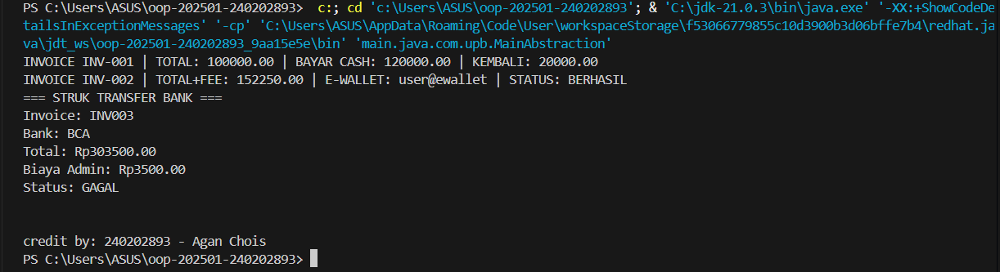

# Laporan Praktikum Minggu 1 (sesuaikan minggu ke berapa?)
Topik: Abstraction (Abstract Class & Interface)

## Identitas
- Nama  : Agan Chois
- NIM   : 240202893
- Kelas : 3IKRB

---

## Tujuan
- Mahasiswa mampu **menjelaskan perbedaan abstract class dan interface**.
- Mahasiswa mampu **mendesain abstract class dengan method abstrak** sesuai kebutuhan kasus.
- Mahasiswa mampu **membuat interface dan mengimplementasikannya pada class**.
- Mahasiswa mampu **menerapkan multiple inheritance melalui interface** pada rancangan kelas.
- Mahasiswa mampu **mendokumentasikan kode** (komentar kelas/method, README singkat pada folder minggu).

---

## Dasar Teori
**Abstraksi** adalah proses menyederhanakan kompleksitas dengan menampilkan elemen penting dan menyembunyikan detail implementasi.
- **Abstract class**: tidak dapat diinstansiasi, dapat memiliki method abstrak (tanpa badan) dan non-abstrak. Dapat menyimpan state (field).
- **Interface**: kumpulan kontrak (method tanpa implementasi konkret). Sejak Java 8 mendukung default method. Mendukung **multiple inheritance** (class dapat mengimplementasikan banyak interface).
- Gunakan **abstract class** bila ada _shared state_ dan perilaku dasar; gunakan **interface** untuk mendefinisikan kemampuan/kontrak lintas hierarki.

Dalam konteks Agri-POS, **Pembayaran** dapat dimodelkan sebagai abstract class dengan method abstrak `prosesPembayaran()` dan `biaya()`. Implementasi konkritnya: `Cash` dan `EWallet`. Kemudian, interface seperti `Validatable` (mis. verifikasi OTP) dan `Receiptable` (mencetak bukti) dapat diimplementasikan oleh jenis pembayaran yang relevan.

---

## Langkah Praktikum
1. **Abstract Class – Pembayaran**
   - Buat `Pembayaran` (abstract) dengan field `invoiceNo`, `total` dan method:
     - `double biaya()` (abstrak) → biaya tambahan (fee).
     - `boolean prosesPembayaran()` (abstrak) → mengembalikan status berhasil/gagal.
     - `double totalBayar()` (konkrit) → `return total + biaya();`.

2. **Subclass Konkret**
   - `Cash` → biaya = 0, proses = selalu berhasil jika `tunai >= totalBayar()`.
   - `EWallet` → biaya = 1.5% dari `total`; proses = membutuhkan validasi.

3. **Interface**
   - `Validatable` → `boolean validasi();` (contoh: OTP).
   - `Receiptable` → `String cetakStruk();`

4. **Multiple Inheritance via Interface**
   - `EWallet` mengimplementasikan **dua interface**: `Validatable`, `Receiptable`.
   - `Cash` setidaknya mengimplementasikan `Receiptable`.

5. **Main Class**
    - Buat `MainAbstraction.java` untuk mendemonstrasikan pemakaian `Pembayaran` (polimorfik).
    - Tampilkan hasil proses dan struk. Di akhir, panggil `CreditBy.print("[NIM]", "[Nama]")`.

6. **Commit dan Push**
   - Commit dengan pesan: `week5-abstraction-interface`.

---

## Kode Program
### Pembayaran.java (abstract)
```java
package com.upb.agripos.model.pembayaran;

public abstract class Pembayaran {
    protected String invoiceNo;
    protected double total;

    public Pembayaran(String invoiceNo, double total) {
        this.invoiceNo = invoiceNo;
        this.total = total;
    }

    public abstract double biaya();               // fee/biaya tambahan
    public abstract boolean prosesPembayaran();   // proses spesifik tiap metode

    public double totalBayar() {
        return total + biaya();
    }

    public String getInvoiceNo() { return invoiceNo; }
    public double getTotal() { return total; }
}
```

### Interface: Validatable & Receiptable
```java
package com.upb.agripos.model.kontrak;

public interface Validatable {
    boolean validasi(); // misal validasi OTP/ PIN
}
```
```java
package com.upb.agripos.model.kontrak;

public interface Receiptable {
    String cetakStruk();
}
```

### Cash.java (extends Pembayaran, implements Receiptable)
```java
package com.upb.agripos.model.pembayaran;

import com.upb.agripos.model.kontrak.Receiptable;

public class Cash extends Pembayaran implements Receiptable {
    private double tunai;

    public Cash(String invoiceNo, double total, double tunai) {
        super(invoiceNo, total);
        this.tunai = tunai;
    }

    @Override
    public double biaya() {
        return 0.0;
    }

    @Override
    public boolean prosesPembayaran() {
        return tunai >= totalBayar(); // sederhana: cukup uang tunai
    }

    @Override
    public String cetakStruk() {
        return String.format("INVOICE %s | TOTAL: %.2f | BAYAR CASH: %.2f | KEMBALI: %.2f",
                invoiceNo, totalBayar(), tunai, Math.max(0, tunai - totalBayar()));
    }
}
```

### EWallet.java (extends Pembayaran, implements Validatable & Receiptable)
```java
package com.upb.agripos.model.pembayaran;

import com.upb.agripos.model.kontrak.Validatable;
import com.upb.agripos.model.kontrak.Receiptable;

public class EWallet extends Pembayaran implements Validatable, Receiptable {
    private String akun;
    private String otp; // sederhana untuk simulasi

    public EWallet(String invoiceNo, double total, String akun, String otp) {
        super(invoiceNo, total);
        this.akun = akun;
        this.otp = otp;
    }

    @Override
    public double biaya() {
        return total * 0.015; // 1.5% fee
    }

    @Override
    public boolean validasi() {
        return otp != null && otp.length() == 6; // contoh validasi sederhana
    }

    @Override
    public boolean prosesPembayaran() {
        return validasi(); // jika validasi lolos, anggap berhasil
    }

    @Override
    public String cetakStruk() {
        return String.format("INVOICE %s | TOTAL+FEE: %.2f | E-WALLET: %s | STATUS: %s",
                invoiceNo, totalBayar(), akun, prosesPembayaran() ? "BERHASIL" : "GAGAL");
    }
}
```

### MainAbstraction.java
```java
package com.upb.agripos;

import com.upb.agripos.model.pembayaran.*;
import com.upb.agripos.model.kontrak.*;
import com.upb.agripos.util.CreditBy;

public class MainAbstraction {
    public static void main(String[] args) {
        Pembayaran cash = new Cash("INV-001", 100000, 120000);
        Pembayaran ew = new EWallet("INV-002", 150000, "user@ewallet", "123456");

        System.out.println(((Receiptable) cash).cetakStruk());
        System.out.println(((Receiptable) ew).cetakStruk());

    CreditBy.print("[NIM]", "[Nama Mahasiswa]");
    }
}
```
---

## Hasil Eksekusi



---

## Analisis
Program berjalan dengan memanfaatkan abstraksi melalui kelas Pembayaran yang menjadi dasar bagi Cash dan EWallet, sehingga pemanggilan metode dilakukan secara polimorfik tanpa mengetahui detail implementasinya. Saat objek Cash dan EWallet dibuat, masing-masing menghitung biaya tambahan dan menjalankan prosesPembayaran() sesuai aturan spesifiknya, lalu hasilnya ditampilkan dengan memanggil cetakStruk() melalui interface Receiptable. Berbeda dengan minggu sebelumnya yang hanya menggunakan inheritance dasar, minggu ini pendekatannya menekankan abstract class + multiple interface, sehingga desain menjadi lebih fleksibel dan modular. Kendala yang sering muncul adalah salah memahami kapan menggunakan abstract class atau interface, serta error cast ketika memanggil method interface tanpa memastikan objeknya mengimplementasikan interface tersebut. Cara mengatasinya adalah dengan mengecek struktur hierarki class, memastikan import benar, dan memahami peran masing-masing konsep agar desain tetap konsisten dan tidak terjadi konflik tipe.
---

## Kesimpulan
Penerapan abstraksi melalui abstract class dan interface membuat desain sistem pembayaran menjadi lebih rapi, terstruktur, dan mudah dikembangkan. Penggunaan Pembayaran sebagai kelas dasar memungkinkan setiap metode pembayaran memiliki aturan berbeda tetapi tetap mengikuti kerangka yang sama. Implementasi interface seperti Validatable dan Receiptable memberikan fleksibilitas sehingga fitur tambahan dapat ditambahkan tanpa mengubah hierarki utama. Pendekatan ini juga mendukung prinsip clean code karena memisahkan tanggung jawab antara logika pembayaran dan fitur pendukung. Secara keseluruhan, konsep yang digunakan minggu ini membantu membangun sistem dengan struktur yang lebih modular, aman, dan scalable.

---

## Quiz
1. Jelaskan perbedaan konsep dan penggunaan **abstract class** dan **interface**.  
   **Jawaban:** Abstract class digunakan ketika beberapa kelas turunan memiliki struktur data (state) dan perilaku dasar yang sama, sehingga dapat menyimpan field dan method konkrit maupun abstrak. Interface digunakan untuk mendefinisikan kontrak perilaku tanpa menyimpan state, sehingga kelas yang berbeda-beda dapat berbagi kemampuan yang sama. Abstract class mendukung single inheritance, sedangkan interface mendukung multiple inheritance karena sifatnya murni kontrak. Abstract class cocok bila ada common logic, sedangkan interface cocok untuk perilaku tambahan yang bisa diterapkan lintas hierarki class. Secara konsep, abstract class = kerangka dasar, interface = kemampuan tambahan.
2. Mengapa **multiple inheritance** lebih aman dilakukan dengan interface pada Java?  
   **Jawaban:** Karena interface tidak menyimpan state, sehingga tidak menimbulkan konflik pewarisan seperti “diamond problem” yang terjadi bila dua parent memiliki field atau implementasi yang bertentangan. Method default pada interface pun tidak membawa risiko tinggi karena tidak menyimpan data, sehingga mudah dioverride jika terjadi konflik. Java hanya mengizinkan multiple inheritance untuk interface agar arsitektur tetap aman, sederhana, dan bebas ambiguitas. Dengan cara ini, sebuah class bisa memiliki banyak “kemampuan tambahan” tanpa benturan pewarisan data. Hal ini menjaga kejelasan hierarki dan mencegah error runtime.
3. Pada contoh Agri-POS, bagian mana yang **paling tepat** menjadi abstract class dan mana yang menjadi interface? Jelaskan alasannya.  
   **Jawaban:** Pembayaran paling tepat menjadi abstract class karena semua metode pembayaran memiliki struktur dasar yang sama, yaitu invoiceNo, total, perhitungan totalBayar(), serta aturan proses pembayaran yang berbeda sehingga butuh method abstrak. Validatable dan Receiptable cocok menjadi interface karena bersifat kontrak tambahan: ada metode pembayaran yang butuh validasi (seperti EWallet), ada yang tidak; ada yang menghasilkan struk, ada yang formatnya berbeda. Interface memungkinkan berbagai jenis pembayaran mengimplementasikan kemampuan yang sama tanpa harus berada dalam satu hierarki. Dengan pembagian ini, struktur sistem menjadi lebih fleksibel, terorganisir, dan mudah dikembangkan.
