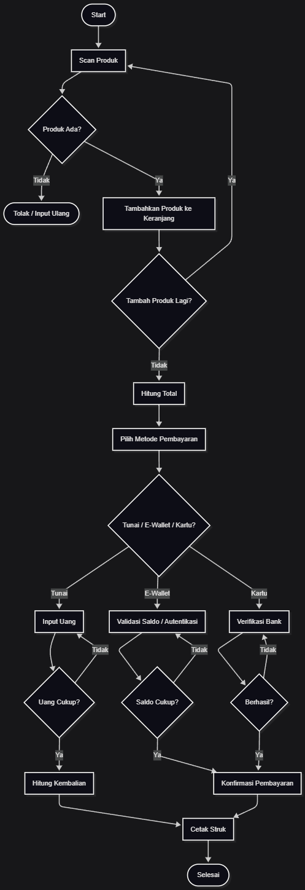
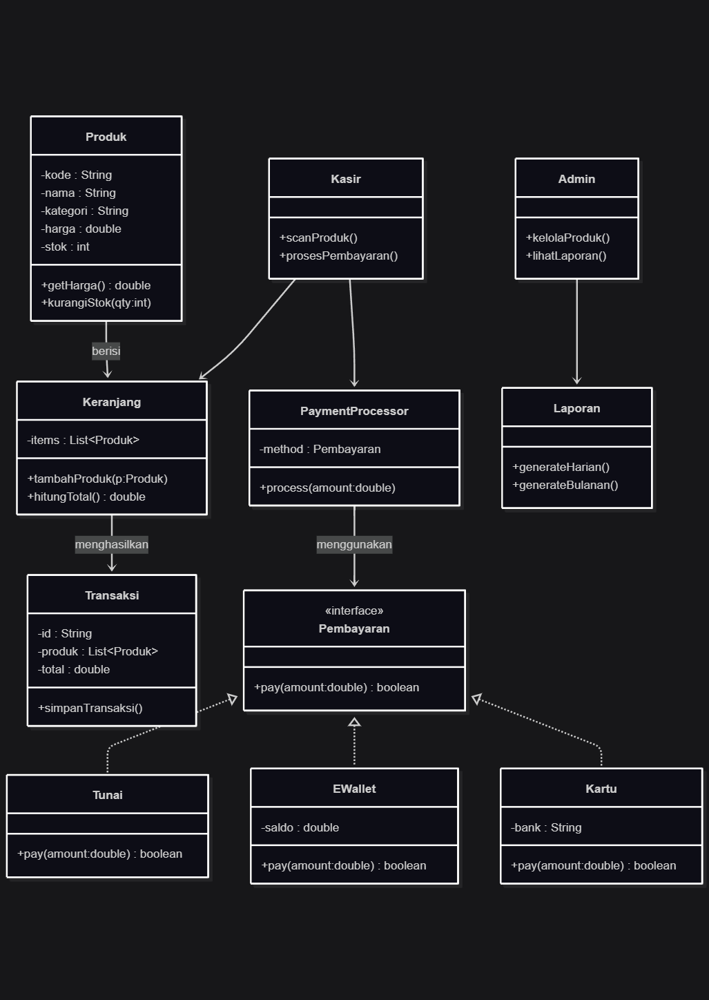
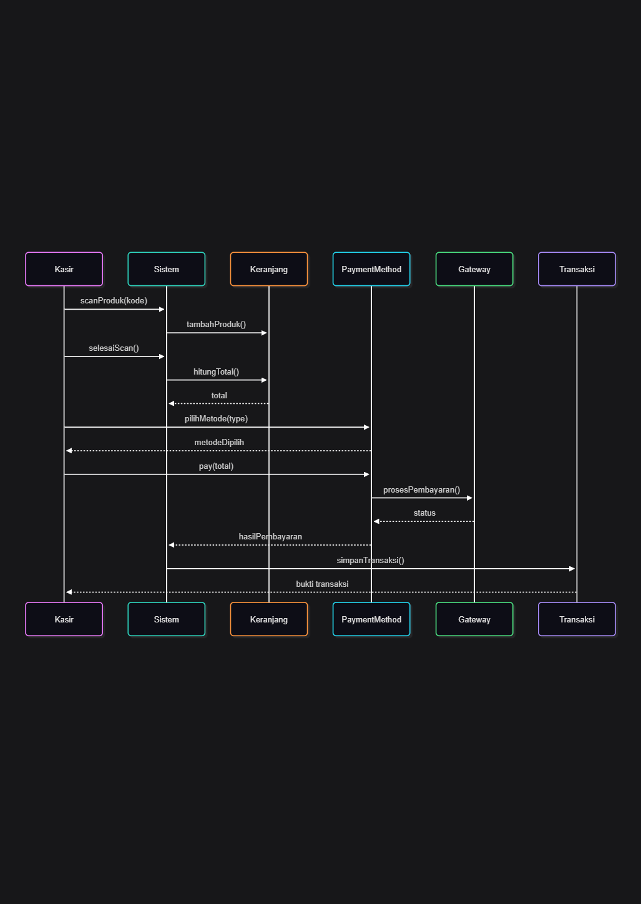
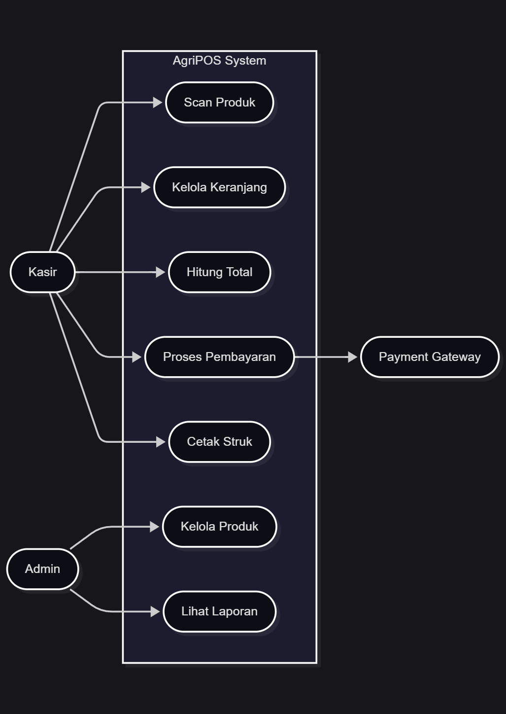

# Laporan Praktikum Minggu 1 (sesuaikan minggu ke berapa?)
Topik: Desain Arsitektur Sistem dengan UML dan Prinsip SOLID

## Identitas
- Nama  : Agan Chois
- NIM   : 240202893
- Kelas : 3IKRB
---

## Tujuan
1. Mahasiswa mampu mengidentifikasi kebutuhan sistem ke dalam diagram UML.
2. Mahasiswa mampu menggambar UML Class Diagram dengan relasi antar class yang tepat.
3. Mahasiswa mampu menjelaskan prinsip desain OOP (SOLID).
4. Mahasiswa mampu menerapkan minimal dua prinsip SOLID dalam kode program.

---

## Dasar Teori
1. Use Case Diagram menjelaskan kebutuhan dan interaksi antara aktor (Kasir dan Admin) dengan fungsi sistem AgriPOS.  
2. Sequence & Activity Diagram menggambarkan urutan komunikasi antar objek serta alur proses transaksi dari scan produk hingga pembayaran.
3. Class Diagram menunjukkan struktur sistem berbasis objek, termasuk kelas, atribut, metode, dan hubungan antar kelas dalam AgriPOS.

---

## Langkah Praktikum
1. Membuat folder proyek berisi struktur src di VS Code.
2. Menginstall Mermaid CLI atau menggunakan ekstensi Markdown untuk merender diagram UML.
3. Membuat masing-masing file:
   - activity.mmd
   - class.mmd
   - sequence.mmd
   - usecase.mmd
4. Menuliskan kode UML Mermaid untuk setiap diagram.
5. Render diagram menjadi gambar .png

---

## Kode Program
### activity.mmd
flowchart TD
    A([Start]) --> B[Scan Produk]
    B --> C{Produk Ada?}
    C -->|Tidak| Z([Tolak / Input Ulang])
    C -->|Ya| D[Tambahkan Produk ke Keranjang]

    D --> E{Tambah Produk Lagi?}
    E -->|Ya| B
    E -->|Tidak| F[Hitung Total]

    F --> G[Pilih Metode Pembayaran]

    G --> H{Tunai / E-Wallet / Kartu?}

    %% Tunai
    H -->|Tunai| I[Input Uang]
    I --> J{Uang Cukup?}
    J -->|Tidak| I
    J -->|Ya| K[Hitung Kembalian]

    %% Non-Tunai
    H -->|E-Wallet| L[Validasi Saldo / Autentikasi]
    L --> M{Saldo Cukup?}
    M -->|Tidak| L
    M -->|Ya| N[Konfirmasi Pembayaran]

    H -->|Kartu| O[Verifikasi Bank]
    O --> P{Berhasil?}
    P -->|Tidak| O
    P -->|Ya| N

    K --> Q[Cetak Struk]
    N --> Q

    Q --> R([Selesai])

### class.mmd
classDiagram

class Produk {
    -kode : String
    -nama : String
    -kategori : String
    -harga : double
    -stok : int
    +getHarga() double
    +kurangiStok(qty:int)
}

class Keranjang {
    -items : List~Produk~
    +tambahProduk(p:Produk)
    +hitungTotal() double
}

class Pembayaran {
    <<interface>>
    +pay(amount:double) boolean
}

class Tunai {
    +pay(amount:double) boolean
}

class EWallet {
    -saldo : double
    +pay(amount:double) boolean
}

class Kartu {
    -bank : String
    +pay(amount:double) boolean
}

class PaymentProcessor {
    -method : Pembayaran
    +process(amount:double)
}

class Transaksi {
    -id : String
    -produk : List~Produk~
    -total : double
    +simpanTransaksi()
}

class Laporan {
    +generateHarian()
    +generateBulanan()
}

class Admin {
    +kelolaProduk()
    +lihatLaporan()
}

class Kasir {
    +scanProduk()
    +prosesPembayaran()
}

Produk --> Keranjang : berisi
Keranjang --> Transaksi : menghasilkan
Pembayaran <|.. Tunai
Pembayaran <|.. EWallet
Pembayaran <|.. Kartu
PaymentProcessor --> Pembayaran : menggunakan
Admin --> Laporan
Kasir --> Keranjang
Kasir --> PaymentProcessor

### sequence.mmd
sequenceDiagram
    participant Kasir
    participant Sistem
    participant Keranjang
    participant Payment as PaymentMethod
    participant Gateway
    participant Transaksi

    Kasir->>Sistem: scanProduk(kode)
    Sistem->>Keranjang: tambahProduk()
    Kasir->>Sistem: selesaiScan()
    Sistem->>Keranjang: hitungTotal()
    Keranjang-->>Sistem: total

    Kasir->>Payment: pilihMetode(type)
    Payment-->>Kasir: metodeDipilih

    Kasir->>Payment: pay(total)
    Payment->>Gateway: prosesPembayaran()
    Gateway-->>Payment: status

    Payment-->>Sistem: hasilPembayaran
    Sistem->>Transaksi: simpanTransaksi()
    Transaksi-->>Kasir: bukti transaksi

### usecase.mmd
flowchart LR
    actorKasir([Kasir])
    actorAdmin([Admin])
    actorGateway([Payment Gateway])

    subgraph AgriPOS System
        UC1([Kelola Produk])
        UC2([Scan Produk])
        UC3([Kelola Keranjang])
        UC4([Hitung Total])
        UC5([Proses Pembayaran])
        UC6([Cetak Struk])
        UC7([Lihat Laporan])
    end

    actorKasir --> UC2
    actorKasir --> UC3
    actorKasir --> UC4
    actorKasir --> UC5
    actorKasir --> UC6

    actorAdmin --> UC1
    actorAdmin --> UC7

    UC5 --> actorGateway

---

## Hasil Eksekusi

---

## Analisis
Kode Mermaid yang digunakan menghasilkan beberapa diagram UML yang merepresentasikan sistem AgriPOS, yaitu Activity Diagram untuk menggambarkan alur proses transaksi, Use Case Diagram untuk menunjukkan interaksi aktor dengan fitur sistem, Sequence Diagram untuk menjelaskan urutan komunikasi antar objek saat pembayaran, dan Class Diagram untuk memodelkan struktur serta relasi antar kelas berbasis OOP. Pendekatan ini berbeda dari minggu sebelumnya karena kini pemodelan sudah lebih teknis, terstruktur, dan berorientasi pada implementasi program, bukan hanya alur proses umum. Dalam proses pengerjaan, beberapa kendala muncul seperti error sintaks Mermaid serta penentuan hubungan antar kelas, namun dapat diatasi dengan memperbaiki format kode sesuai aturan Mermaid dan mengikuti prinsip dasar OOP.
---

## Kesimpulan
Dengan menggunakan pemodelan UML seperti Use Case, Activity, Sequence, dan Class Diagram, perancangan sistem AgriPOS menjadi lebih terstruktur, mudah dipahami, serta siap untuk diimplementasikan ke dalam kode program. UML membantu menggambarkan alur proses, interaksi objek, dan struktur sistem secara jelas sebelum pengembangan dilakukan. Dengan pemodelan yang baik, potensi kesalahan dalam implementasi dapat diminimalkan dan proses pengembangan menjadi lebih efisien.

---

## Quiz
1. Jelaskan perbedaan **aggregation** dan **composition** serta berikan contoh penerapannya pada desain Anda.
   **Jawaban:** Aggregation adalah hubungan antar objek yang bersifat lebih longgar di mana bagian masih dapat berdiri sendiri meskipun objek induknya dihapus, sedangkan Composition merupakan hubungan yang lebih kuat di mana bagian tidak dapat eksis tanpa objek induknya. Pada desain AgriPOS, hubungan Transaksi dengan Produk merupakan aggregation karena produk tetap ada walaupun transaksi sudah selesai, sedangkan Keranjang dengan daftar item produk merupakan composition karena jika keranjang dihapus maka item di dalamnya juga ikut hilang. 

2. Bagaimana prinsip **Open/Closed** dapat memastikan sistem mudah dikembangkan? 
   **Jawaban:** Prinsip Open/Closed memastikan sistem mudah dikembangkan karena kelas dibuat tertutup untuk perubahan tetapi terbuka untuk penambahan fitur baru, sehingga kode yang sudah stabil tidak perlu dimodifikasi saat ada pengembangan baru. Pada desain AgriPOS, penambahan metode pembayaran baru cukup dilakukan dengan membuat kelas baru yang mengimplementasikan interface Pembayaran tanpa perlu mengubah logika utama pada PaymentProcessor, sehingga sistem lebih fleksibel dan aman dari bug saat berkembang. 

3. Mengapa **Dependency Inversion Principle (DIP)** meningkatkan **testability**? Berikan contoh penerapannya.  
   **Jawaban:** Dependency Inversion Principle meningkatkan testability karena modul tingkat tinggi bergantung pada abstraksi, bukan pada implementasi konkret sehingga kita dapat mengganti dependensi dengan objek tiruan saat pengujian. Pada AgriPOS, PaymentProcessor bergantung pada interface Pembayaran, sehingga saat melakukan unit test dapat digunakan MockPayment untuk mensimulasikan proses pembayaran tanpa harus terhubung ke gateway asli, menjadikan pengujian lebih mudah, cepat, dan aman.  
