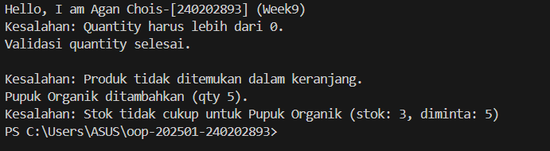

# Laporan Praktikum Minggu 9 
Topik: Exception Handling, Custom Exception, dan Penerapan Design Pattern

## Identitas
- Nama  : Agan Chois
- NIM   : 240202893
- Kelas : 3IKRB

---

## Tujuan
Mahasiswa mampu:

1. Menjelaskan perbedaan antara error dan exception.
2. Mengimplementasikan try–catch–finally dengan tepat.
3. Membuat custom exception sesuai kebutuhan program.
4. Mengintegrasikan exception handling ke dalam aplikasi sederhana (kasus keranjang belanja).
5. (Opsional) Menerapkan design pattern sederhana (Singleton/MVC) dan unit testing dasar.

---

## Dasar Teori
1. Exception Handling digunakan untuk menangani kondisi kesalahan agar program tidak langsung berhenti saat terjadi error.
2. try–catch–finally memungkinkan pemisahan kode normal, penanganan kesalahan, dan proses yang harus selalu dijalankan.
3. Custom Exception dibuat untuk merepresentasikan kesalahan spesifik sesuai kebutuhan logika aplikasi.
4. Enkapsulasi melindungi data objek dengan membatasi akses langsung melalui modifier dan method.
5. Design Pattern (Singleton & MVC) membantu membuat struktur program lebih terorganisir, terkontrol, dan mudah dikembangkan.

---

## Langkah Praktikum
1. Membuat project praktikum minggu ke-9 dengan struktur package `com.upb.agripos`.  
2. Membuat class `Product` yang memiliki atribut kode, nama, harga, dan stok.  
3. Membuat custom exception:
   - `InvalidQuantityException`
   - `ProductNotFoundException`
   - `InsufficientStockException`
4. Mengimplementasikan exception handling pada class `ShoppingCart`.  
5. Menguji program menggunakan class `MainExceptionDemo`.  
6. Menjalankan program dan mengambil screenshot hasil eksekusi.  
7. Melakukan commit dan push ke repository GitHub.

---

## Kode Program
```java
package com.upb.agripos;

public class Product {

    private final String code;
    private final String name;
    private final double price;
    private int stock;

    public Product(String code, String name, double price, int stock) {
        this.code = code;
        this.name = name;
        this.price = price;
        this.stock = stock;
    }

    public String getCode() { return code; }
    public String getName() { return name; }
    public double getPrice() { return price; }
    public int getStock() { return stock; }

    public void reduceStock(int qty) {
        this.stock -= qty;
    }

    // penting untuk Map
    @Override
    public boolean equals(Object o) {
        if (this == o) return true;
        if (!(o instanceof Product)) return false;
        Product p = (Product) o;
        return code.equals(p.code);
    }

    @Override
    public int hashCode() {
        return code.hashCode();
    }
}

```
```java
package com.upb.agripos;

public class InvalidQuantityException extends Exception {
    public InvalidQuantityException(String message) {
        super(message);
    }
}
```
```java
package com.upb.agripos;

public class ProductNotFoundException extends Exception {
    public ProductNotFoundException(String message) {
        super(message);
    }
}
```
```java
package com.upb.agripos;

public class InsufficientStockException extends Exception {
    public InsufficientStockException(String message) {
        super(message);
    }
}
```
```java
package com.upb.agripos;

import java.util.HashMap;
import java.util.Map;

public class ShoppingCart {

    private final Map<Product, Integer> items = new HashMap<>();

    // tambahProduk
    public void addProduct(Product product, int qty)
            throws InvalidQuantityException {

        if (qty <= 0) {
            throw new InvalidQuantityException("Quantity harus lebih dari 0.");
        }

        items.put(product, items.getOrDefault(product, 0) + qty);
        System.out.println(product.getName() + " ditambahkan (qty " + qty + ").");
    }

    // hapusProduk
    public void removeProduct(Product product)
            throws ProductNotFoundException {

        if (!items.containsKey(product)) {
            throw new ProductNotFoundException(
                "Produk tidak ditemukan dalam keranjang."
            );
        }

        items.remove(product);
        System.out.println(product.getName() + " dihapus dari keranjang.");
    }

    // checkout
    public void checkout() throws InsufficientStockException {

        for (Map.Entry<Product, Integer> entry : items.entrySet()) {
            Product p = entry.getKey();
            int qty = entry.getValue();

            if (p.getStock() < qty) {
                throw new InsufficientStockException(
                    "Stok tidak cukup untuk " + p.getName() +
                    " (stok: " + p.getStock() + ", diminta: " + qty + ")"
                );
            }
        }

        // pengurangan stok
        for (Map.Entry<Product, Integer> entry : items.entrySet()) {
            entry.getKey().reduceStock(entry.getValue());
        }

        System.out.println("Checkout berhasil. Stok diperbarui.");
    }
}
```
```java
package com.upb.agripos;

public class MainExceptionDemo {

    public static void main(String[] args) {

        System.out.println("Hello, I am Agan Chois-[240202893] (Week9)");

        ShoppingCart cart = new ShoppingCart();
        Product pupuk = new Product("P01", "Pupuk Organik", 25000, 3);

        // 1. Invalid quantity
        try {
            cart.addProduct(pupuk, -1);
        } catch (InvalidQuantityException e) {
            System.out.println("Kesalahan: " + e.getMessage());
        } finally {
            System.out.println("Validasi quantity selesai.\n");
        }

        // 2. Remove product not in cart
        try {
            cart.removeProduct(pupuk);
        } catch (ProductNotFoundException e) {
            System.out.println("Kesalahan: " + e.getMessage());
        }

        // 3. Insufficient stock
        try {
            cart.addProduct(pupuk, 5);
            cart.checkout();
        } catch (Exception e) {
            System.out.println("Kesalahan: " + e.getMessage());
        }
    }
}
```
---

## Hasil Eksekusi 


---

## Analisis
Kode berjalan dengan alur pembuatan objek Product dan ShoppingCart, kemudian setiap aksi seperti menambah, menghapus, dan checkout produk divalidasi menggunakan exception handling sehingga kesalahan (jumlah tidak valid, produk tidak ada, atau stok kurang) dapat ditangani tanpa menghentikan program. Perbedaan pendekatan minggu ini dibanding minggu sebelumnya adalah penggunaan custom exception dan try–catch untuk menangani error secara terstruktur, sedangkan sebelumnya lebih fokus pada logika dasar dan pengecekan manual menggunakan kondisi if. Kendala yang dihadapi adalah menentukan jenis exception yang tepat dan alur penanganannya, namun dapat diatasi dengan memisahkan setiap kesalahan ke dalam custom exception yang spesifik sehingga kode menjadi lebih jelas dan mudah dipelihara.
---

## Kesimpulan
Penerapan exception handling dan custom exception pada Agri-POS membuat program lebih aman, terstruktur, dan mampu menangani kesalahan dengan baik tanpa menghentikan proses aplikasi.

---

## Quiz
1. Jelaskan perbedaan error dan exception.
   **Jawaban:** Error merupakan kesalahan fatal yang umumnya tidak dapat ditangani oleh program dan menyebabkan aplikasi berhenti, sedangkan exception adalah kondisi kesalahan yang masih dapat ditangani oleh program menggunakan mekanisme try–catch.

2. Apa fungsi finally dalam blok try–catch–finally?  
   **Jawaban:** Finally berfungsi untuk menjalankan kode yang harus selalu dieksekusi, baik terjadi exception maupun tidak, misalnya untuk menutup resource atau membersihkan proses.

3. Mengapa custom exception diperlukan?
   **Jawaban:** Custom exception diperlukan agar kesalahan dapat didefinisikan secara spesifik sesuai kebutuhan logika aplikasi, sehingga penanganan error menjadi lebih jelas, terstruktur, dan mudah dipahami.

4. Berikan contoh kasus bisnis dalam POS yang membutuhkan custom exception.
   **Jawaban:** Contohnya saat kasir memasukkan jumlah pembelian nol atau negatif, saat produk tidak ditemukan dalam keranjang, atau ketika stok barang tidak mencukupi pada proses checkout.
